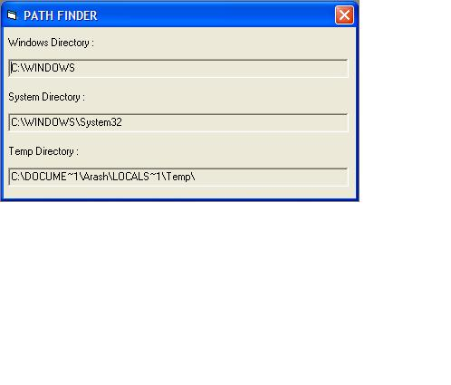

<div align="center">

## A Little App For Findng WINDOWS and SYSTEM and TEMP Folder  On every Computer


</div>

### Description

This is THE FASTEST AND MOST RELAIBLE Code To Find WINDOWS and SYSTEM and TEMP Directory On Every Conputer With Any Setting..!!!
 
### More Info
 
Directories.


<span>             |<span>
---                |---
**Submitted On**   |2000-08-04 17:08:40
**By**             |[Arash Yadegarnia](https://github.com/Planet-Source-Code/PSCIndex/blob/master/ByAuthor/arash-yadegarnia.md)
**Level**          |Beginner
**User Rating**    |4.4 (44 globes from 10 users)
**Compatibility**  |VB 4\.0 \(16\-bit\), VB 4\.0 \(32\-bit\), VB 5\.0, VB 6\.0
**Category**       |[Complete Applications](https://github.com/Planet-Source-Code/PSCIndex/blob/master/ByCategory/complete-applications__1-27.md)
**World**          |[Visual Basic](https://github.com/Planet-Source-Code/PSCIndex/blob/master/ByWorld/visual-basic.md)
**Archive File**   |[A\_Little\_A114133842002\.zip](https://github.com/Planet-Source-Code/arash-yadegarnia-a-little-app-for-findng-windows-and-system-and-temp-folder-on-every-compu__1-37612/archive/master.zip)

### API Declarations

```
Private Declare Function GetWindowsDirectory Lib "kernel32" Alias "GetWindowsDirectoryA" (ByVal lpBuffer As String, ByVal nSize As Long) As Long
Private Declare Function GetSystemDirectory Lib "kernel32" Alias "GetSystemDirectoryA" (ByVal lpBuffer As String, ByVal nSize As Long) As Long
Private Declare Function GetTempPath Lib "kernel32" Alias "GetTempPathA" (ByVal nBufferLength As Long, ByVal lpBuffer As String) As Long
```


